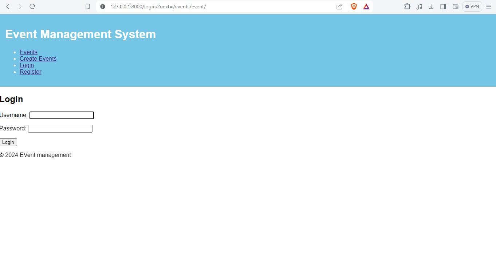
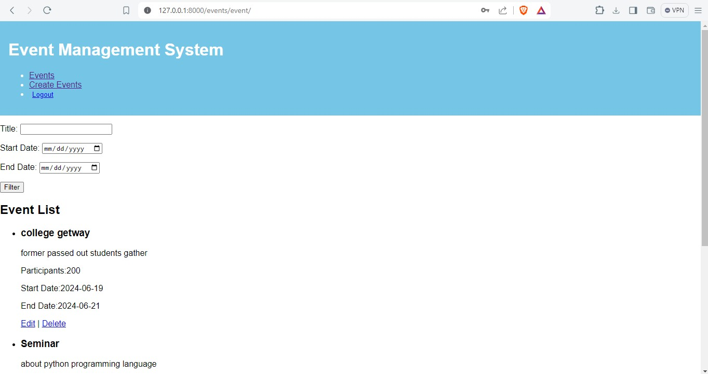
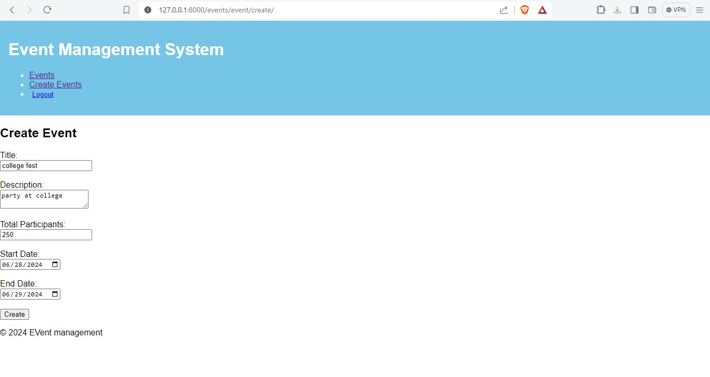
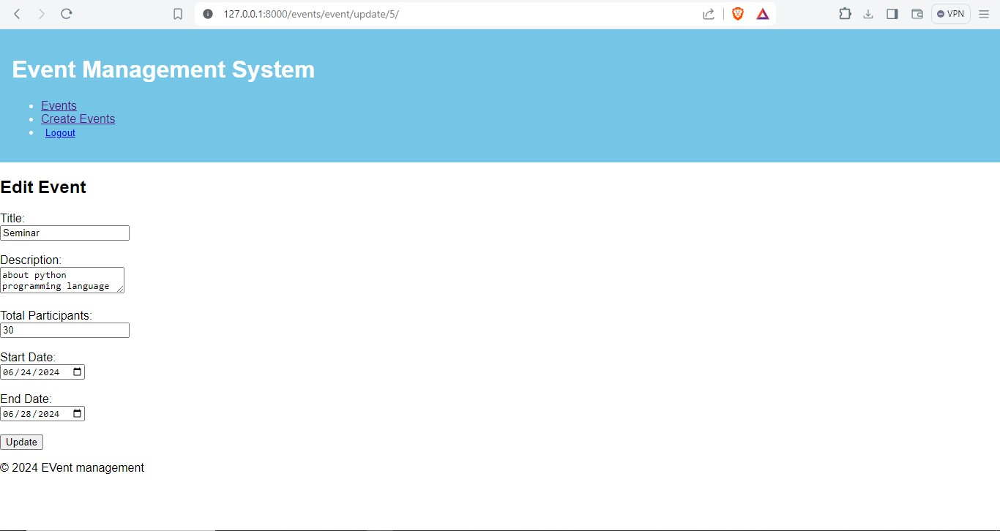
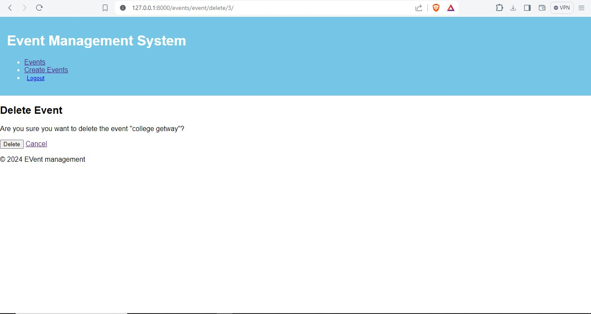

# Event Management System


An event management application such as a hackathon, seminar, college fest, etc., The event management application allows organizers/users to perform CRUD operations on events.The management application can stores data in a JSON file instead of a database.Only the authenticated users can perform CRUD operations.

## Run Locally


Go to the project directory

```bash
  cd my-project
```

Install dependencies
pip install django,
pip install django_crispy_forms,
pip install crispy_bootstrap4


Start the server

```bash
  python manage.py runserver
```








